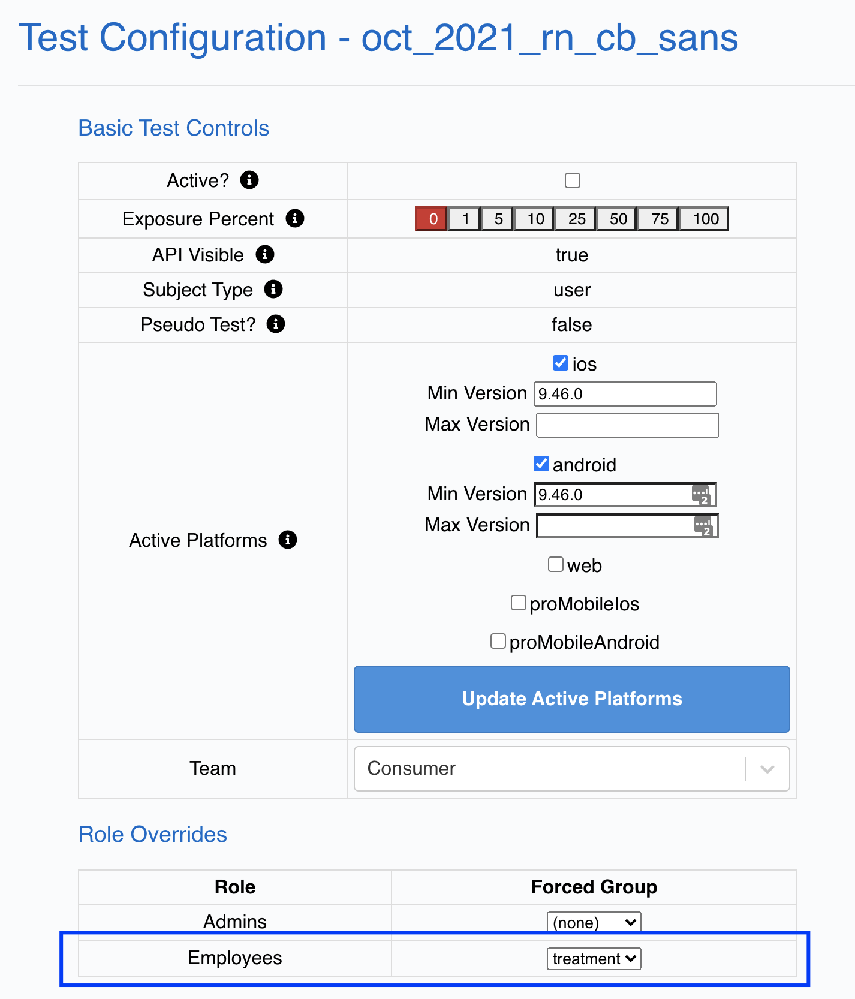
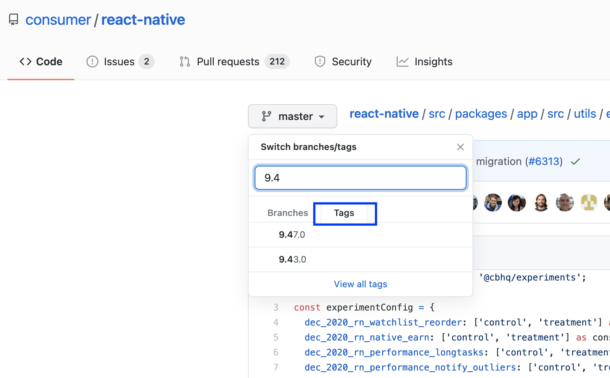
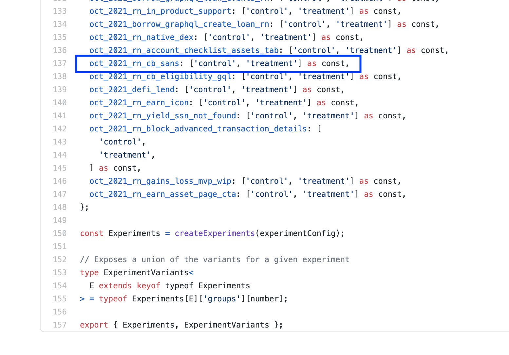

# Contribute to Coinbase Design System

If you are having issues with your environment please review the [monorepo README](https://github.cbhq.net/mono/repo/tree/master/#monorepo)

Another thing you may want to do is run this command at the root of the mono/repo. Feel free to grab some ☕️ as there are a lot of dependencies.

```bash
yarn
```

### Table of Contents

- [Web Development](#web-development)
- [React Native Development](#react-native-development)
- [The CDS Website Development](#cds-website-development)
- [Testing](#testing)
- [Miscellaneous](#miscellaneous)

# Web development

## Setup

Please run codegen before running anything else to create necessary code including icons.

```
make codegen
```

## CDS-Web Development Workflow

The section outlines how components for web should be developed within CDS.

### Storybook

Storybook is the best place to add and iterate on new CDS components for web.

### Build Storybook

```bash
make build.story
```

### Run Storybook Local Dev Server

```bash
make start.story
```

### Deploy Master Design System

[Master Design System Hosted Link](https://cds-web-storybook.cbhq.net/master/index.html)

```bash
bazel run //eng/shared/design-system/web/cloud:storybook
```

The command builds a production bundle of the storybook, zips it, and uploads the zipped file to S3 through [syn](https://confluence.coinbase-corp.com/display/INFRA/Syn) deploy.

### Deploy Feature Branch

[https://cds-web-storybook.cbhq.net/feature/YOUR_FEATURE_BRANCH_NAME/index.html](https://cds-web-storybook.cbhq.net/feature/YOUR_FEATURE_BRANCH_NAME/index.html)

Configure the url of the hosted feature branch by changing the path for the S3 zip in this file [eng/prime/frontend/cloud/BUILD.bazel](../cloud/BUILD.bazel)

_Don't use any `/` slashes in the feature branch name as it will confuse the HTML path_

```bazel
pkg_zip(
  name = "bundled_storybook_feature",
  srcs = [
      "//eng/shared/design-system/web:storybook",
  ],
  remap_paths = {"{gendir}/eng/shared/design-system/web/storybook": "feature/YOUR_FEATURE_BRANCH_NAME"},
  visibility = ["//visibility:public"],
)
```

```bash
bazel run //eng/shared/design-system/web/cloud:storybook_feature
```

# React Native Development

## Setup

This section helps you install and build the CDS React Native app to test components on mobile.

> Note: Run these commands in eng/shared/design-system folder. Also, make sure your fork is up to date with master

### Installing dependencies

You will need the following:

- **Cocoapods**
- **XCode**
- **XCode CLI**
- **Android Studio**
- **Java 8 and the Android SDK**
- **Watchman**

### Cocoapods

[Cocoapods](https://cocoapods.org/) is a Ruby-based dependency manager for Swift and Objective-C projects. After installing an up-to-date version of Ruby and ensuring that it's being targeted (`ruby -v`), run the following to install bundler:

```shell
gem install cocoapods
```

### XCode

[XCode](https://developer.apple.com/xcode/) is an IDE for developing macOS and iOS applications and is necessary for working with React Native. Install it through the [App Store](https://apps.apple.com/us/app/xcode/id497799835?mt=12).

#### Xcode Command-line Tools

You'll also need a [family of command-line tools](http://osxdaily.com/2014/02/12/install-command-line-tools-mac-os-x/) that will allow you to leverage some of XCode's functionality from the terminal. Install them by running:

```shell
xcode-select --install
```

### Android Studio

[Android Studio](https://developer.android.com/studio/intro) is an IDE for developing Android applications and is necessary for working with React Native. Download the application from [the Android developer site](https://developer.android.com/studio/install#mac) and follow the install instructions.

#### Java 8 and the Android SDK

[OpenJDK](https://adoptopenjdk.net/index.html) is an open-source implementation of the Java platform and is necessary to develop React Native apps with Android. To install, run the following:

```shell
# Install Java 8
brew tap AdoptOpenJDK/openjdk
brew install --cask adoptopenjdk8

# Note: if you have other versions installed, you'll need to set the default Java on your computer to Java 8
# You can do this by setting JAVA_HOME in your relevant (.zshenv|.zshrc|.bashrc)
# export JAVA_HOME=/Library/Java/JavaVirtualMachines/adoptopenjdk-8.jdk/Contents/Home

# Install the Android SDK
brew install --cask android-sdk
```

Be sure to follow any post-install instructions that Homebrew provides. If you want to revisit these instructions, run `brew info --cask android-sdk`.

You can verify that OpenJDK has been installed by running `sdkmanager --version`.

Configure the `ANDROID_HOME` environment variable. Add the following lines to your `$HOME/.zshrc` or `$HOME/.bash_profile` config file.

```shell
export ANDROID_HOME=$HOME/Library/Android/sdk
export PATH=$PATH:$ANDROID_HOME/emulator
export PATH=$PATH:$ANDROID_HOME/tools
export PATH=$PATH:$ANDROID_HOME/tools/bin
export PATH=$PATH:$ANDROID_HOME/platform-tools
```

Type `source $HOME/.bash_profile` or `source $HOME/.zshrc` to load the config into your current shell. You can verify by running `adb` command.

### Watchman

[Watchman](https://facebook.github.io/watchman/) is a service used by Metro to trigger rebuilds whenever a relevant file changes. To install it, run:

```shell
brew install watchman
```

Be sure to follow any post-install instructions that Homebrew provides. If you want to revisit these instructions, run `brew info watchman`.

### Known issues

> Failed to install the following Android SDK packages as some licences have not been accepted.

- Open Android Studio
- Tools > SDK Manager
- Select the `Android 10.0 (Q)` image, press the Apply button and then follow the instructions. The installer should prompt to accept the license

If the issue persist select the second tab (SDK Tools) and install the missing packages from there.

If you see:

```
xcrun: error: SDK "iphoneos" cannot be located
xcrun: error: SDK "iphoneos" cannot be located
xcrun: error: unable to lookup item 'Path' in SDK 'iphoneos'
```

when running `xcrun -k --sdk iphoneos --show-sdk-path` or when trying to install dependencies, try running `sudo xcode-select --switch /Applications/Xcode.app` (from [this github issue](https://github.com/facebook/react-native/issues/18408#issuecomment-386696744))

> Watchman Permission denied

- Run `yarn start:{app/onboarding/designSystem}` (after `yarn setup:{...}`)
- See the following error:

```
Failed to open {$HOME}/Library/LaunchAgents/com.github.facebook.watchman.plist for write: Permission denied
```

Try running `sudo chown -R $(whoami):staff ~/Library/LaunchAgents` (from [this github issue](https://github.com/facebook/react-native/issues/9116))

## React Native CDS Development Workflow

### Running mobile-playground in simulator

_Run the following steps in the terminal in this order_

1. `make setup.mobile` (Note: you should only need to run this once, and after every time you run `make clean.ios/android`)
2. `make start.mobile`
3. While `make start.mobile` is running in the terminal/shell, run `make build.ios/make build.android` (depends on what mobile OS you want to test) in another terminal

### Adding new example screen

1. Run `make start.mobile` and open simulator.
2. Create your component screen in mobile-playground/src/screens. The only requirement is that the screen has a default export.
3. Run `make mobile.routes` to generate the necessary routing for the new screen.
4. Confirm your new item is showing up in the master list of simulator and when clicking it navigates to its respective screen.
5. If you want a different title than the file name you can add your title override to the `titleOverrides` map in mobile-playground/src/routing/routes.

### Troubleshooting Guide

- **Emulator failed to load** Try manually launching the Emulator from terminal. Be sure the emulator also exists in Android Studio's AVD manager.
- When in doubt, run `make clean.ios/android` and then run through the previous 3 steps again (in order).

## Retail RN Experiments

### Setup

- Follow the steps in the Retail RN repo [here](https://github.cbhq.net/consumer/react-native/blob/master/doc/guides/add-an-experiment-or-feature-flag.md)

### Integrate

- Once you have setup the experiment in code, you need to access [Sherlock](https://sherlock.cbhq.net/) with the right permissions/Admin roles (general, engineer, cifer, level_2_support) follow the docs [here](https://github.cbhq.net/consumer/react-native/blob/master/doc/guides/add-an-experiment-or-feature-flag.md#step-1-access-cifer-via-sherlock)
- Now that you have access to Sherlock, you can create tests by following the instructions [here](https://github.cbhq.net/consumer/react-native/blob/master/doc/guides/add-an-experiment-or-feature-flag.md#step-2-create-a-new-experiment)

### Refine

- Find the earliest Retail RN version has your experiment
  - You will need to find the release that has your experiment to refine the test in Sherlock, specifically what is the minimum version to run it on.
  - To do this, look in the [RN repo](https://github.cbhq.net/consumer/react-native) for the latest release and work your way backwards until you see your experiment in the config file [Experiments.tsx](https://github.cbhq.net/consumer/react-native/blob/master/src/packages/app/src/utils/experiments/Experiments.tsx)
- Employee dogfooding
  - To force employees into the control bucket, add them to the treatment group
    

### Tips

- Add yourself to the `@rn-release-notifications` slack group for updates on releases
- you can filter down branches of releases by Tags  
- If you know what release your experimentation PR was merged, you can just swap out the version in this GH link to check the experiment config file directly `https://github.cbhq.net/consumer/react-native/blob/release-{MAJOR.MINOR.PATCH}/src/packages/app/src/utils/experiments/Experiments.tsx`

# CDS Website Development

The CDS website (which can be accessed at go/cds or https://cds.cbhq.net) is built using using Docusaurus 2 and is where we document CDS principles, best practices, components, hooks and more. This website is very important because it gives the consumers of the design system a centralized location to identify the best way for their team to leverage the design system.

As you implement CDS components it will be expected that you will contribute to this site's documentation to clearly communicate the associated principles to our consumers.

### Local Development

```console
make start.website
```

This command starts a local development server and open up a browser window. Most changes are reflected live without having to restart the server.

### Build

```console
make build.website
```

### Serve

```console
make serve.website
```

### Deploy

```console
ash_login
ash deploy -p eng/shared/design-system/website/cloud
```

Select the artifact to deploy.

Please not that anything you want to deploy to production aka cds.cbhq.net must be merged into master prior to deployment. This is because artifcats only exist for merges to master.

### Deploy Dev

```console
ash_login
make deploy.website-dev
```

### Debugging s3 bucket

1. Go to okta https://coinbase.okta.com/
2. Select AWS
3. Select "production @ read" at bottom of roles list
4. Select s3 card from dashboard
5. URL should be https://s3.console.aws.amazon.com/s3/buckets/coinbase-design-system-website

## How to auto generate component docs

Once you have built the component for **_both web and mobile_**. You can auto generate the documentation associated with it by following these steps:

1. If you are not adding new directory, please go to step 2. If you are adding new directory you will need to add the name in `CDS_SUB_DIRS` in `eng/shared/design-system/codegen/website/constants.ts`

2. Run `make docgen` in the root of eng/shared/design-system (make sure you've exported your component from the appropriate subdirectory, first)

## Adding new imports to react-live

For any usage examples, you can use all imports defined in `website/src/theme/ReactLiveScope/index.ts` directly without importing them in your jsx live.

For adding new imports, simply import in the same file and add it to the `ReactLiveScope` object.

## Adding a prototype page

Creating a prototype means you can access the component using a link like this https://cds.cbhq.net/inputs. In this case, we are
creating a prototype for inputs. However, the link generated will be in this form - https://cds.cbhq.net/<your-component>.

Follow these steps to add a prototype page to the docusaurus website. This can be useful for bug bashing.

1. Add your <component>.<mdx | tsx> file to eng/shared/design-system/website/src/pages
2. Add the new component doc to docusaurus.config.js file under Prototypes dictionary. Mimic what the other prototype components have done.

## Hide page from sidebar

If you want to hide your doc page from the sidebar, you can add your component path to `componentsToExcludeByLabel` inside `eng/shared/design-system/website/sidebars.js`. For example,

```
const componentsToExcludeByLabel = new Set([
  'components/visualizations/ProgressBar/progress-bar',
]);
```

This is useful when you are prototyping the component and don't want it to be visible to consumers.

# Miscellaneous

For any usage examples, you can use all imports defined in `website/src/theme/ReactLiveScope/index.ts` directly without importing them in your jsx live.

For adding new imports, simply import in the same file and add it to the `ReactLiveScope` object.

# Release and CDS Consumers

You will often hear CDS team members refer to retail, prime, assetHub (and others) as consumers. CDS consumers are any teams at Coinbase that leverage CDS.

We release our packages to consumers through Coinbase's internal NPM registry (Verdaccio - https://publish-npm.cbhq.net/). Each package includes source TypeScript files for all typings information, and Babel transpiled ES modules at `lib/`. To split up the CSS code, we wrote a custom Babel plugin to take Linaria transpiled styles and put them into `.css` files corresponding to the `.js` files.

The following sections describe how to push new package releases to our consumers through Verdaccio.

### Creating a New Release

When you're ready to cut a new release, do the following:

1. Run `make release` in the `eng/shared/design-system` directory.

This script will automatically update the `CHANGELOG` with the latest version and add latest merged PR titles, links, and Jira tickets. It will also run the docgen script and lint the website files.

Copy the title that is in the logs and paste it to be you pull request title.

Your pr should like this https://github.cbhq.net/mono/repo/pull/34005

This is an example of how we would update the retail app to use an updated version of the CDS package https://github.cbhq.net/mono/repo/pull/34005

The `make release` script will automatically update the `CHANGELOG` with the latest version and add latest merged PR titles, links, and Jira tickets. It will also run the docgen script and lint the website files.

Checkout the [Release Workflow](https://cds.cbhq.net/resources/release) for more information.
For packages that are pre v1.0.0 we are not following a weekly Monday release like some docs may suggest. In order to move fast engineers will bump release as components are added.

### Manual Release

If `Make release` fails we must do a manual release.

Continuous deploy is turned on for CDS package publishing. If you need to trigger a manual deploy, do the following

1. Run

```bash
assume-role development eng-ops (for development)
ash_login (for production)
ash deploy -p eng/shared/design-system/cloud
```

2. Enter the number for the commit/package you want to deploy for prod or development registry

3. Check that the package is published at[development Coinbase NPM registry](https://publish-npm-dev.cbhq.net/) or [production Coinbase NPM registry](https://publish-npm.cbhq.net/). It usually takes about 10 min or so for the package to be uploaded.

# Miscellaneous

### API Documentation

Because our components are used by so many teams it is vital that we document their APIs well. This section give a quick preview of how to effectively document our components.

Web + Mobile documentation is viewed together on our website and we try minimze API deviation. However, there are times when the behavior slightly varies or there is a unique callout we want to make for a specific platform. To accomadate this we use JSDOC tags within API definitions to aid in documentation generation.

- `@default`: Default value of a property
- `@danger`: Property which is used as an escape hatch and is not recommended.
- `@link`: Link to MDN React Native or other documentation which is relevant
- `@experimental`: Experimental/unstable API's
- `@deprecated`: Deprecated API's

If you want to add a custom example or more details for a component you can create a directory in website/docs/components/examples matching the component's name. In that component's directory you can add mdx files for intro.mdx (shown at the very top of page), outro.mdx (at the very bottom of page) or for individual properties. For example, in examples/ThemeProvider we have a spectrum.mdx file with a live code example.

Don't forget to add an index.ts to that component's example directory with exports for any children mdx files. You will also need to add a wildcard export for the directory in website/docs/components/examples/index.ts.

### Commit Message Conventions

To ensure the changelog is correctly generated and packages are correctly versioned and released, you must ensure your commit messages follow convention. If your PR has multiple commits, you will need to format your _squash_ commit message the following way:

```
# Without a jira ticket
[trivial] {logType}: {message}

# With one or many jira tickets
[CDS-xxx] {logType}: {message}
```

With `logType` being one of the following:

- breaking - major version bump
- feat, change, new, update - minor version bump
- fix, patch, chore, types - patch version bump
- release, internal, docs, tests - no-op

To make your life easier, add these aliases to your `.alias.zsh`:

```
# git commit trivial aliases
gct() {
  git commit -m "[trivial] $1: $2"
}

# Major version bump
alias gct:breaking='gct breaking $2'
# Minor version bump
alias gct:feat='gct feat $2'
alias gct:change='gct change $2'
alias gct:new='gct new $2'
alias gct:update='gct update $2'
# Patch version bump
alias gct:fix='gct fix $2'
alias gct:patch='gct patch $2'
alias gct:chore='gct chore $2'
alias gct:types='gct types $2'
# No-op
alias gct:release='gct release $2'
alias gct:internal='gct internal $2'
alias gct:docs='gct docs $2'
alias gct:tests='gct tests $2'
```

More info: [tools/js/releasePackages.ts](https://github.cbhq.net/mono/repo/blob/master/tools/js/releasePackages.ts)

### Adoption Script

#### Overview

config - codegen/adoption/config.ts
script - codegen/adoption/prepare.ts
parser - codegen/adoption/parsers/Parser.ts

### Adding a project

Add to codegen/adoption/config.ts and run `make prepare.adoption` and it will automatically be added to website

### Running script

1. Run `make prepare.adoption`

2. The result will be output to json files to codegen and website

3. Commit changes

# Testing

When you build anything at CDS, you should at least create 1 test case for each item you build. This section will describe how you can test your new feature within monorepo and also outside of monorepo.

<br />

## **Running Test Cases within Monorepo**

**Test Mobile**: To run tests on mobile, run the command `make test.mobile` inside CDS Directory.

**Test Web**: To run tests on web, run the command `make test.web` inside CDS Directory.

**Both**: You can also test both by running the command `make test` inside CDS Directory

<br />

By default, these commands will run every test that exist. You can configure it such that it only run tests that you care about.

<br />

### **Selectively Test Web Features**

<br />

To do this, you need to modify [`jest.config.web.js`](eng/shared/design-system/jest.config.web.js) file. Change the regular expression so that it only matches tests you care about.

For example, if you change the testMatch to this, it will only run tests for Alert.

```
testMatch: ['**/__tests__/**/Alert.test.[jt]s?(x)'],
```

You can also test more than 1 feature at a time. Here is an example of how you can test InputStack and Alert simultaneously

```
testMatch: [
  '**/__tests__/**/InputStack.test.[jt]s?(x)',
  '**/__tests__/**/Alert.test.[jt]s?(x)'
]
```

<br />

> **Note:** Please don't commit your jest.config.web.js changes.

### **Selectively Test Mobile Features**

<br />

The steps required to selectively test mobile features are very similar to how you do it in web. The only difference is that you will be modifying [`jest.config.mobile.js`](eng/shared/design-system/jest.config.mobile.js) instead.

<br />

> **Note:** Please don't commit your jest.config.mobile.js changes.

<br />

## **Testing Locally on external projects**

- Build your project and any dependencies of that project with `make build.packages`.
- The output of the packages above will be in `bazel-out/darwin-fastbuild/bin/eng/shared/design-system`. Locate your package in the subdirectory `[package]/package`. For example
  `cds-mobile` would be in `bazel-out/darwin-fastbuild/bin/eng/shared/design-system/mobile/package`
- Copy the absolute path to your package
- In the external project add to dependencies and resolution portion of package.json to guarantee everything is pulling from your local packages:

```
  "@cbhq/cds-common": "file:/absolute path to this/repo/bazel-out/darwin-fastbuild/bin/eng/shared/design-system/common/package",
  "@cbhq/cds-fonts": "file:/absolute path to this/repo/bazel-out/darwin-fastbuild/bin/eng/shared/design-system/fonts/package"
  "@cbhq/cds-lottie-files": "file:/absolute path to this/repo/bazel-out/darwin-fastbuild/bin/eng/shared/design-system/lottie-files/package",
  "@cbhq/cds-mobile": "file:/absolute path to this/repo/bazel-out/darwin-fastbuild/bin/eng/shared/design-system/mobile/package"
  "@cbhq/cds-utils": "file:/absolute path to this/repo/bazel-out/darwin-fastbuild/bin/eng/shared/design-system/utils/package"
  "@cbhq/cds-web": "file:/absolute path to this/repo/bazel-out/darwin-fastbuild/bin/eng/shared/design-system/web/package"
```

- Run `yarn install` on the external project
- If you update the package in the monorepo and want to sync it in the external project then you will have to run `yarn upgrade [dependency]`. For example `yarn upgrade @cbhq/cds-common`
