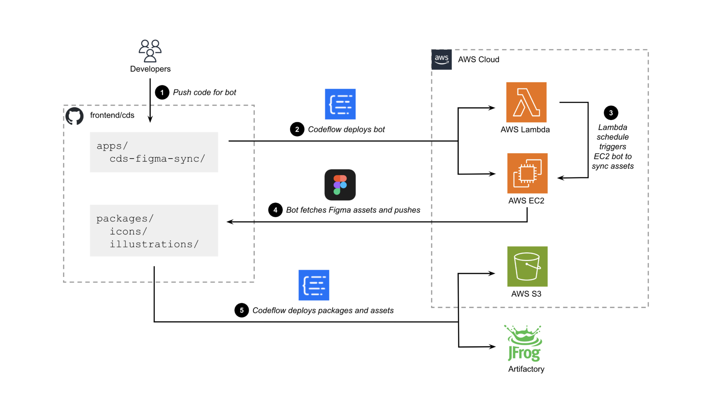

# cds-figma-sync

## Table of Contents

1. [How it works](#how-it-works)
2. [Configuring the bot](#configuring-the-bot)
3. [Debugging error messages](#debugging-error-messages)
4. [Documentation links](#documentation-links)
5. [About Octokit](#about-octokit)
6. [About this GitHub app](#about-this-github-app)

## How it works

**The `cds-figma-sync` bot is live at [cds-figma-sync.cbhq.net](https://cds-figma-sync.cbhq.net/logs)**

> The AWS resources for this project are defined in [`infra/aws-resources/projects/frontend/cds.gps.yml`](https://github.cbhq.net/infra/aws-resources/blob/master/projects/frontend/cds.gps.yml), except the `static-assets` S3 bucket, which is defined in [`infra/aws-resources/projects/engineering/static-assets.gps.yml`](https://github.cbhq.net/infra/aws-resources/blob/master/projects/engineering/static-assets.gps.yml).

The `apps/cds-figma-sync` workspace contains code for the `cds-figma-sync` bot, as well as dockerfiles for the bot's EC2 and Lamba deployments, and a dockerfile for the S3 `static-assets` bucket deployment. This project makes use of [`libs/script-utils/src/bot`](/libs/script-utils/src/bot/index.ts) to work within a cloned git repo.

When the EC2 instance starts up, it resets large log files then begins listening on `http://0.0.0.0:3001` with the following endpoints:

| Endpoint   | Result               |
| ---------- | -------------------- |
| `/sync`    | Start bot asset sync |
| `/logs`    | Show all logs        |
| `/errors`  | Show only error logs |
| `/_health` | Respond with a 200   |

The Lambda function will run on a regular schedule (defined in the Codeflow deployment configs) and hit the EC2 `/sync` endpoint to start the sync process automatically. You can also manually trigger the sync by visiting the `/sync` endpoint.

When the asset sync process is running, this is what happens:

1. Reset large log files
2. Set the `temp` working directory and create it if necessary
3. Retrieve the config data including GitHub private key and Figma access token
4. Initialize the Octokit integration with the config data
5. Retrieve the bot's installation repo data
6. Check if the installation repo already exists locally, and clone it if necessary
7. Set the working directory to the cloned repo
8. If the repo is not freshly cloned, update the repo remote to refresh the auth token, reset any local changes, and pull master
9. Install dependencies with yarn
10. Run Nx targets to download and process Figma assets and styles, and codegen package contents
11. If no changes exist, stop running
12. Otherwise run Nx targets to codegen icons and illustrations Storybook stories
13. Checkout a new branch and create a commit with those changes
14. Push the new branch and create a PR from it
15. Run `mono-pipeline version` to update changelogs and package versions, using the PR number previously created
16. Run `yarn release` to generate markdown files for the docs site
17. Commit and push the changes
18. Close any other PRs that the bot had previously opened

Once the PR has been approved and merged, the `static-assets` Codeflow configs will automatically build and deploy illustrations to the `static-assets` S3 bucket if they detect the [`packages/illustrations/package.json`](/packages/illustrations/package.json) file has changed.

## Configuring the bot

The [`./src/config.ts`](./src/config.ts) file must be configured for this CDS git repo (the bot's installation repo).

## Debugging error messages

- `RequestError [HttpError]: Resource not accessible by integration` - This means the GitHub App doesn't have the correct permission settings to access an API. **You must uninstall and reinstall the GitHub App to wherever it's installed any time you change permissions.**

- `Renames and deletions are breaking changes` - We run Nx targets with the `--exitOnBreakingChanges` flag, which prevents the bot from automatically releasing breaking changes. Breaking change releases must be manually handled by developers.

## Documentation links

> **IMPORTANT NOTE:** Make sure you are reading the _GitHub Enterprise Server 3.7_ docs for both GitHub Apps and the GitHub REST API. Do NOT use the normal GitHub docs. The URL should always have `enterprise-server@3.7` in it, e.g. `https://docs.github.com/en/enterprise-server@3.7/apps` and not just `https://docs.github.com/en/apps`.

#### GitHub Enterprise Server 3.7 - GitHub App docs

- [GitHub Apps overview](https://docs.github.com/en/enterprise-server@3.7/apps/overview)
- [About creating GitHub Apps](https://docs.github.com/en/enterprise-server@3.7/apps/creating-github-apps/about-creating-github-apps/about-creating-github-apps)
- [Registering a GitHub App](https://docs.github.com/en/enterprise-server@3.7/apps/creating-github-apps/registering-a-github-app/registering-a-github-app)
- [Best practices for creating a GitHub App](https://docs.github.com/en/enterprise-server@3.7/apps/creating-github-apps/about-creating-github-apps/best-practices-for-creating-a-github-app)
- [About authentication with a GitHub App](https://docs.github.com/en/enterprise-server@3.7/apps/creating-github-apps/authenticating-with-a-github-app/about-authentication-with-a-github-app)
- [Choosing permissions for a GitHub App](https://docs.github.com/en/enterprise-server@3.7/apps/creating-github-apps/registering-a-github-app/choosing-permissions-for-a-github-app)
- [GitHub REST API - Permissions required for GitHub Apps](https://docs.github.com/en/enterprise-server@3.7/rest/overview/permissions-required-for-github-apps)
- [About using GitHub Apps](https://docs.github.com/en/enterprise-server@3.7/apps/using-github-apps/about-using-github-apps)
- [About writing code for a GitHub App](https://docs.github.com/en/enterprise-server@3.7/apps/creating-github-apps/writing-code-for-a-github-app/about-writing-code-for-a-github-app)

#### GitHub REST API docs

- [GitHub REST API documentation](https://docs.github.com/en/enterprise-server@3.7/rest)
- [GitHub REST API - Permissions required for GitHub Apps](https://docs.github.com/en/enterprise-server@3.7/rest/overview/permissions-required-for-github-apps)
- [GitHub App API](https://docs.github.com/en/enterprise-server@3.7/rest/apps/apps)

#### GitHub's Octokit npm package docs

- [Scripting with the GitHub REST API and JavaScript](https://docs.github.com/en/enterprise-server@3.7/rest/guides/scripting-with-the-rest-api-and-javascript)
- [Octokit features](https://github.com/octokit/octokit.js#features)
- [Octokit `App` client](https://github.com/octokit/octokit.js#app-client)
- [`@octokit/app` API reference](https://github.com/octokit/app.js#readme)

## About Octokit

[Octokit](https://github.com/octokit/octokit.js#features) is the GitHub API's official SDK. The `octokit` npm package combines several core packages for integrating with [different aspects of GitHub's APIs](https://github.com/octokit/octokit.js#readme). We'll be using the [`@octokit/app`](https://github.com/octokit/app.js#readme) package to integrate with our GitHub App.

## About this GitHub App

This GitHub App is designed to be installed to a specific repo that houses the CDS Figma assets. This App [authenticates as a GitHub App](https://docs.github.com/en/enterprise-server@3.7/apps/creating-github-apps/authenticating-with-a-github-app/authenticating-as-a-github-app) to access the [GitHub App API](https://docs.github.com/en/enterprise-server@3.7/rest/apps/apps) and as an [individual installation of the app](https://docs.github.com/en/enterprise-server@3.7/apps/creating-github-apps/authenticating-with-a-github-app/authenticating-as-a-github-app-installation) - as opposed to authenticating on behalf of a user who has the app installed. This normally requires [creating a JWT](https://docs.github.com/en/enterprise-server@3.7/apps/creating-github-apps/authenticating-with-a-github-app/generating-a-json-web-token-jwt-for-a-github-app), but the `octokit` npm package handles creating a JWT for us. We have to [create a private key](https://docs.github.com/en/enterprise-server@3.7/apps/creating-github-apps/authenticating-with-a-github-app/managing-private-keys-for-github-apps) and pass it to the Octokit `App` client on initialization, so that Octokit can create the JWT.
