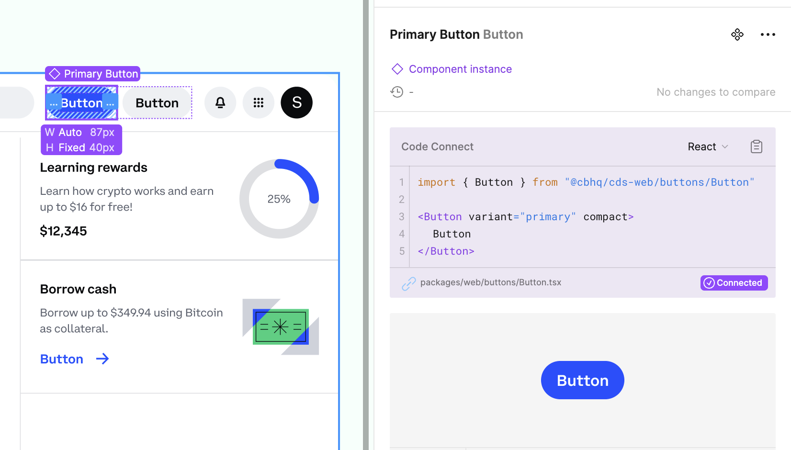

# Code Connect

Code Connect is a tool for connecting your design system components in code with your design system in Figma. When using Code Connect, Figma's Dev Mode will display true-to-production code snippets from your design system instead of autogenerated code examples.

In addition to connecting component definitions, Code Connect also supports mapping properties from code to Figma enabling dynamic and correct examples. This can be useful for when you have an existing design system and are looking to drive consistent and correct adoption of that design system across design and engineering.

Code Connect is easy to set up, easy to maintain, type-safe, and extensible. Out of the box Code Connect comes with support for React (and React Native), Storybook and HTML.

### Overview

The exact steps you take to set up Code Connect depend on the architecture of your design system and codebase. Generally, your organization will follow these steps to get started:

#### 1. Plan the implementation:

- Identifying the components in your codebase that you want to integrate with Dev Mode.
- Planning the configuration of Code Connect and the mappings of your components.
- Contact the UI Systems team to help create a figma token with the right permissions

#### 2. Implement the component mappings ([guide](https://github.com/figma/code-connect/blob/main/docs/react.md)):

- The exact way you build the mappings will depend on your codebase and design system, but broadly the process involves mapping properties from your design system components to properties in Figma.
- This allows Code Connect to generate snippets of code that map the values in Figma to the architecture of your components, and then surface those snippets inside Dev Mode.

#### 3. Review in Dev Mode:

- In Dev Mode, review the Code Connect output with your developers and designers to ensure the practical usability of the component examples and that the representations are accurate.

To take full advantage of Code Connect, the engineers responsible for your design system components should work with your designers and the UI Systems team to implement the mappings from your codebase to Figma.

For more information about **_Code Connect_** as well as official React guides, please [go here](https://github.com/figma/code-connect/blob/main/docs/react.md).

### CI/CD

Once you have set up and published your first connected components it may be beneficial to integrate Code Connect with your CI/CD environment to simplify maintenance and to ensure component connections are always up to date.

We recommend creating an NX target publish-figma and add the the following command as a step in your Buildkite/GHA CI:

`yarn nx affected --target=publish-figma --dry-run`

--dry-run: Performs a dry run of publishing, returning errors if any exist but does not publish your connected components.

### Privacy and Code Connect

Figma only collects the minimum data needed to enable Code Connect in the interface. When you run figma connect using the Code Connect command-line interface, Figma gets the following data:

- The paths for components that are added
- The repository URL where the Code Connect components are implemented
- The properties and code in the .figma files

Figma logs only basic events for understanding Code Connect usage: when components are published or unpublished, and calls to get Figma data when using the command-line interface.

For more information about Figma's approach to privacy, see Figma's [Privacy Policy](https://www.figma.com/legal/privacy/).

