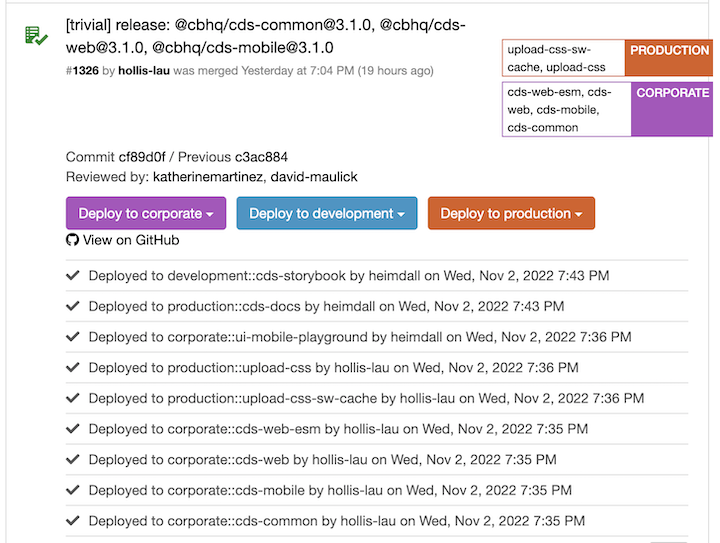

# Release Workflows

CDS regularly has to cut releases to expose our library through packages or assets (via a CDN) so our consumers can use them in their applications. You will often hear CDS team members refer to retail, prime, assetHub (and others) as consumers. CDS consumers are any teams at Coinbase that leverage CDS.

## Release through Verdaccio

We release our packages to consumers through Coinbase's internal NPM registry (Verdaccio - https://publish-npm.cbhq.net/). Each package includes source TypeScript files for all typings information, and Babel transpiled ES modules. To split up the CSS code, we wrote a custom Babel plugin to take Linaria transpiled styles and put them into `.css` files corresponding to the `.js` files.

The following sections describe how to push new package releases to our consumers through Verdaccio.

### Creating a New Release

When you're ready to cut a new release, do the following:

1. Run `yarn codegen release` in the repo root directory.

This script will automatically update the `CHANGELOG` with the latest version and add latest merged PR titles, links, and Jira tickets. It will also run the docgen script and lint the website files.

Copy the title that is in the logs and use it for **BOTH** the commit and the PR title. Since this is likely a single commit, if the commit message is not the provided title, it will break the `CHANGELOG` for future commits.

Your PR should like [this](https://github.cbhq.net/frontend/cds/pull/249).

[This](https://github.cbhq.net/consumer/react-native/pull/8067) is an example of how we would update the retail app to use an updated version of the CDS package. Please see directions below on how to manually deploy a CDS bump to the CB Alpha app.

The `yarn codegen release` script will automatically update the `CHANGELOG` with the latest version and add latest merged PR titles, links, and Jira tickets. It will also run the docgen script and lint the website files.

Checkout the [Release Workflow](https://cds.cbhq.net/resources/release) for more information.
For packages that are pre v1.0.0 we are not following a weekly Monday release like some docs may suggest. In order to move fast engineers will bump release as components are added.

### Manual Release

After a release PR is merged, the following should automatically be deployed:

- the website

If the website is not updated, following the steps here to [deploy](./website.md).

You will need to trigger a manual deploy in [Codeflow](https://codeflow.cbhq.net/#/frontend/cds/commits) to publish the npm packages to Verdaccio.

You should only deploy the packages that are listed in the commit. If you are deploying cds-web then you must also deploy the built css and cds-web-esm.
For example in the screenshot below you must deploy:

- corporate::cds-web-esm
- corporate::cds-web
- corporate::cds-common
- corporate::cds-mobile
- production::upload-css
- production::upload-css-sw-cache

After the Codeflow deploy has succeeded, double check that the package is published at [development Coinbase NPM registry](https://publish-npm-dev.cbhq.net/) or [production Coinbase NPM registry](https://publish-npm.cbhq.net/). It usually takes about 10 min or so for the package to be uploaded.

You will also need to verify that the CSS was deployed to AWS. If web was bumped, verify `upload_css` was deployed to AWS (i.e. `https://assets.coinbase.com/cds/web/version-0.18.0.css`). Verify `upload_css_sw_cache` deployed to aws was bumped (ie: `https://assets.coinbase.com/assets/sw-cache/web/version-0.30.8.css`) which should be mapped to `https://coinbase.com/assets/sw-cache/web/version-0.30.8.css`

## Manually Release to CB Alpha

Sometimes we want to test updates to the `@cbhq/cds-mobile` package in the `react-native` retail app. You can deploy a branch to CB Alpha without merging to `master` via [firebase](https://buildkite.com/coinbase/retail-rn-ios-firebase-delivery). Follow the directions [here](https://confluence.coinbase-corp.com/pages/viewpage.action?pageId=1243176705#:~:text=scheduled%20release%20train.-,Alpha%20Builds%20from%20custom%20branches,-Sometimes%2C%20it%20is).

## CDS Illustration Release

1. Run `yarn codegen illustrations`
2. Run both android and iOS and make sure the new illustrations didn't break either build.
3. Verify that the illustrations match what is on go/icon-illo-release-history under the illustrations section
4. You'll then need to deploy the assets in the [static-assets](https://github.cbhq.net/engineering/static-assets) repository. Follow the steps in [How to make an illustration release](https://docs.google.com/document/d/1dp5doJ8EzLpeE1PG8KscBwD-azM54hQRG0JW0HVdDnI/edit#heading=h.ng5jyeh1c16v), which is how we deploy assets to our production CDN.
5. Go back to the `frontend/cds` and cut a PR with the prepared illustrations.

## CDS Icon Release

1. Run `yarn codegen icons`
2. Run both android and iOS and make sure the new illustrations didn't break either build.
3. Verify that the icons maatch what it on go/icon-illo-release-history