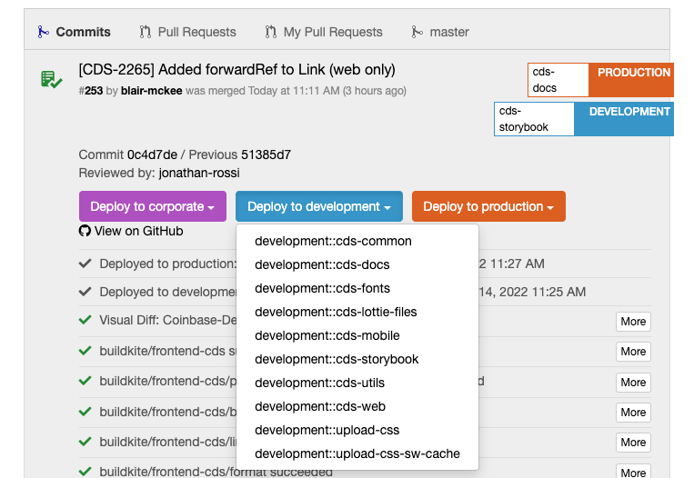

# Web development

## Setup

Please run codegen before running anything else to create necessary code including icons.

```
yarn codegen all
```

## CDS-Web Development Workflow

The section outlines how components for web should be developed within CDS.

## Storybook

Storybook is the best place to add and iterate on new CDS components for web. The local storybook project is located here: `apps/storybook`

### Run Storybook Local Dev Server

```bash
yarn storybook start
```

### Build Storybook

```bash
yarn storybook build
```

### Storybook Deployment

Storybook is deployed to https://cdsstorybook.cbhq.net/ on every commit. This is configured in [codeflow](https://codeflow.cbhq.net/#/frontend/cds/commits) through the `development::cds-storybook` task

