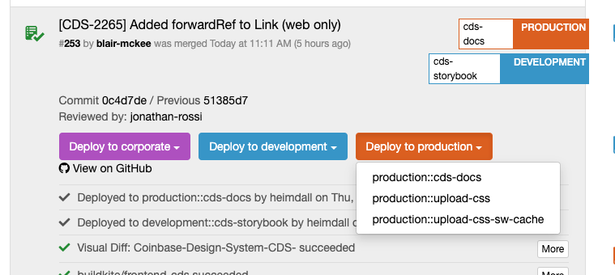

# Commands

The CDS website (which can be accessed at [go/cds](https://cds.cbhq.net)) is built using using Docusaurus 2 and is where we document CDS principles, best practices, components, hooks and more.

This website is very important because it gives the consumers of the design system a centralized location to identify the best way for their team to leverage the design system.

As you implement CDS components it will be expected that you will contribute to this site's documentation to clearly communicate the associated principles to our consumers.

## Local Development

`start` - starts a local development server and opens up a browser window. Most changes are reflected live without having to restart the server.

```console
yarn website start
```

`starts.all` - starts local development server and watches plugins

```console
yarn website start.all
```

## Build

```console
yarn website build
```

## Serve

You can serve the built website with the command below. You can use this approach if you wish to test what is deployed to https://cds.cbhq.net in your local environment.

```console
yarn website serve
```

## Deploy

After a commit is merged to master the website should auto deploy. You can view the status of a deployment on [Codeflow](https://codeflow.cbhq.net/#/frontend/cds/commits).

The codeflow target is `production::cds-docs`.



# Deployments

## Codeflow

You can trigger a deploy to dev via [Codeflow](https://codeflow.cbhq.net/#/frontend/cds/commits). The development target is
`development::cds-docs`.

## Debugging production s3 bucket

1. Go to okta https://coinbase.okta.com/
2. Select AWS
3. Select "production @ read" at bottom of roles list
4. Select s3 card from dashboard
5. URL should be https://s3.console.aws.amazon.com/s3/buckets/coinbase-design-system-website

## Debugging dev s3 buckets

You can delete files from AWS UI for dev environment

1. Go to okta https://coinbase.okta.com/
2. Select AWS
3. Select "sudo-dev @ development" at bottom of roles list
4. Select s3 card from dashboard
5. Search for coinbase-design-system-website-development for dev. For next + other dev envs you can search for `cds`.

# Docs

## Step 1. Add to docgen.config.js

Add the path to the component's source code (without package prefix or file extension) to the `sourceFiles` array in [website/docgen.config.js](../apps/website/docgen.config.js)

```js
module.exports = {
  // ...

  sourceFiles: ['buttons/Button'],

  // ...
};
```

## Step 2. Start website

- Run `yarn website start` to start website
- Run `yarn website start.all` to run website and watch plugins if you plan to update any of the plugins source code used in website.
- You will now have access to the API data for components in docgen.config.js.

## Step 3. Create mdx files

### Root file

- Create a root mdx file in [docs/components](../apps/website/docs/components/)
  - The location of this file should mirror the structure of where it lives in sidebar.
    - Most component docs are at the root of the "Components" category, however, there are some components where it makes more sense to bucket it under a family or some base component. For example, Remote Image Group is a child doc of the Remote Image category.
    - As our library grows, going completely flat is going to get too overwhelming.
    - You should work with your design partner to align on naming/api proposals and where component will live in sidebar.

```shell
touch apps/website/docs/components/button/button.mdx
```

### Partials

- `_implementation.mdx` partial for API data

```shell
touch apps/website/docs/components/button/_implementation.mdx
```

```js
import WebPropsTable from ':docgen/web/buttons/Button/api.mdx';
import MobilePropsTable from ':docgen/mobile/buttons/Button/api.mdx';

## Props

<Tabs groupId="platform" variant="secondary">
  <TabItem value="web" label="Web">
    <WebPropsTable />
  </TabItem>
  <TabItem value="mobile" label="Mobile">
    <MobilePropsTable />
  </TabItem>
</Tabs>
```

- `_design.mdx` partial for design guidelines

```shell
touch apps/website/docs/components/button/_design.mdx
```

- `_metadata.mdx` partial for showing import xyz from '@cbhq/cds-xyz` info

```shell
touch apps/website/docs/components/button/_metadata.mdx
```

```js
<Tabs groupId="platform" variant="secondary">
  <TabItem value="web" label="Web">
    <ImportBlock name="Button" from="@cbhq/cds-web/buttons/Button" />
  </TabItem>
  <TabItem value="mobile" label="Mobile">
    <ImportBlock name="Button" from="@cbhq/cds-mobile/buttons/Button" />
  </TabItem>
</Tabs>
```

- `_usage.mdx` for any examples you want to include above API tables

```shell
touch apps/website/docs/components/button/_usage.mdx
```

````js
Buttons must have a visual label (passed as a child), and can use variants to denote intent and importance.

```jsx live
<HStack gap={2}>
  <Button onPress={console.log}>Save</Button>
  <Button onPress={console.log} variant="secondary">
    Cancel
  </Button>
</HStack>
```

````

### Update root file

Depending on the partials you add above, update the root mdx file (button.mdx) with the following

```js
---
title: Button
slug: /components/button
---
import Design, { toc as designToc } from './_design.mdx';
import Metadata, { toc as metadataToc } from './_metadata.mdx';
import Usage, { toc as usageToc } from './_usage.mdx';
import Implementation, { toc as implementationToc } from './_implementation.mdx';

<Tabs groupId="page">
  <TabItem value="design" label="Guidelines" toc={designToc}>
    <Design />
  </TabItem>
  <TabItem
    value="implementation"
    label="Implementation"
    toc={[...metadataToc, ...usageToc, ...implementationToc]}
  >
    <Metadata />
    <Usage />
    <Implementation />
  </TabItem>
</Tabs>

```

## Step 4. Update sidbear

Add doc to [sidbar.config.js](../apps/website/sidebar.config.js)

# Table of contents (right sidebar)

## TOCUpdater

If you use mdx partials for breaking up large documentation you lose Docusaurus's automatic table of contents generation in right sidebar.

To get around this we leverage the global [`toc` variable](https://docusaurus.io/docs/2.0.0-beta.20/markdown-features/react#available-exports) that is available for each mdx page and manually create a single `toc` on the main doc where the mdx partials are spread into.

To make this easier we have a component, `@theme/TOCUpdater`, which you can use to pass the aggregated toc into.

```tsx
import Partial1, { toc1 } from './_partial1.mdx'
import Partial2, { toc2 } from './_partial2.mdx'

<TOCUpdater toc={[...toc1, ...toc2]} />

<Partial1 />
<Partial2 />
```

## Table of contents with Tabs

Use the `toc` prop available on the TabItem component. The `toc` prop is passed to `@theme/TOCUpdater` internally.

```tsx
import Design, { toc as designToc } from './_design.mdx';
import Implementation, { toc as implementationToc } from './_implementation.mdx';
import Metadata, { toc as metadataToc } from './_metadata.mdx';
import Usage, { toc as usageToc } from './_usage.mdx';

<Tabs groupId="page">
  <TabItem value="design" label="Guidelines" toc={designToc}>
    <Design />
  </TabItem>
  <TabItem value="eng" label="Engineering" toc={[...usageToc, ...implementationToc]}>
    <Metadata />
    <Usage />
    <Implementation />
  </TabItem>
</Tabs>;
```

# MDX Components

You can view or add any components you want to be globally available in all mdx files in [MDXComponents.tsx file](../packages/docusaurus-theme/src/theme/MDXComponents.tsx) of our theme plugin.

# react-live

## Adding new imports to react-live

For any usage examples, you can use all imports defined in `apps/website/src/theme/ReactLiveScope/index.ts` directly without importing them in your jsx live.

For adding new imports, simply import in the same file and add it to the `ReactLiveScope` object.

# Sidebar

## Hide page from sidebar

- Option 1: Exclude from [sidebar.config.js](../apps/website/sidebar.config.js)
- Option 2: Add `draft: true` to doc's frontmatter

# Plugins

Plugins are the building blocks of features in a Docusaurus site. Each plugin handles its own individual feature. Plugins may work and be distributed as part of a bundle via presets.

Docusaurus' implementation of the plugins system provides us with a convenient way to hook into the website's lifecycle to modify what goes on during development/build, which involves (but is not limited to) extending the webpack config, modifying the data loaded, and creating new components to be used in a page.

Plugin code and theme code never directly import each other: they only communicate through protocols (in our case, through JSON temp files and calls to addRoute).

When you run `yarn website start` you should see a [.docusaurus folder](../apps/website/.docusaurus). This is the `temp` directory the Docusaurus offers for plugins to output content to.

## Docgen plugin

[README](../packages/docusaurus-plugin-docgen/README.md)

## KBar plugin

[README](../packages/docusaurus-plugin-kbar/README.md)

## Theme

[README](../packages/docusaurus-theme/README.md)

## Preset

[README](../packages/docusaurus-preset/README.md)
