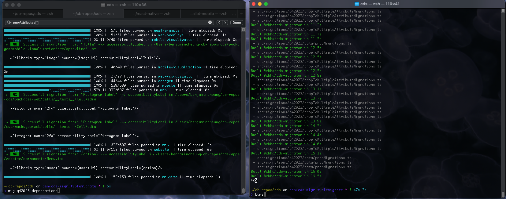

# @cbhq/cds-migrator

Codemod transformations to help upgrade your CDS codebase

## Getting started

1. Install

```shell
yarn add @cbhq/cds-migrator --dev
```

2. Setup handy aliases in your `.alias.zsh`

```shell
# Running generator
alias mig="yarn nx generate @cbhq/cds-migrator:migrate"

# Wipe nx cache and build package with watch for CDS migrator
alias bumi="yarn nx run cds-migrator:build --skip-nx-cache && yarn nx run cds-migrator:watch"
```

3. Wipe nx cache and build the package and watch changes. Open new terminal and run:

```shell
# With alias
bumi

# Without alias
yarn nx run cds-migrator:build --skip-nx-cache && yarn nx run cds-migrator:watch
```

4. Run the generator and pass in the version you are trying to migrate to

```shell
# With alias
 mig <version>

# Example
mig 4.0.0

# Without alias
yarn nx generate @cbhq/cds-migrator:migrate <version>

# Example
yarn nx generate @cbhq/cds-migrator:migrate 4.0.0

```

5. Clear NX cache when needed

```shell
yarn nx reset
```

### Example setup:



## Inspiration

https://polaris.shopify.com/tools/polaris-migrator#usage

## Create Your Own Migrator Script

1. Create a directory under `src/migrations/update<YOUR_VERSION>` suffixed with the CDS version you're upgrading to.
2. Create your migrator functions in this directory. You can access the project tree (the NX project where you are running the script) by passing `tree` as an argument to the default export function in a migrator file. Check out the "Writing Your Own Migrator Script" section for guidance on how to write these functions.
3. Add a case for the version you are adding to the switch case statement in `packages/cds-migrator/src/generators/migrate/migrate.ts` and pass it your migrator functions and the tree as an argument.
4. Add the same key to `properties.version.enum` in `src/generators/migrate/schema.json`
5. Clear your NX cache with `yarn nx reset`
6. Build and watch for changes in the migrator package by running `yarn nx run cds-migrator:build --skip-nx-cache && yarn nx run cds-migrator:watch`
7. Test your script by running `yarn nx generate @cbhq/cds-migrator:migrate <YOUR_VERSION>`
8. When your script is complete, run `yarn mono-pipeline` and complete the CLI steps to version the package. Run `yarn release` to verify that no other packages need to be bumped. After your PR merges, deploy the package via codeflow.

## Debugging

1. Before you run any scripts, make sure you build the migrator package by running `yarn nx run cds-migrator:build --skip-nx-cache`.
2. Then run `yarn nx run cds-migrator:watch` and it will rebuild the package as you make changes.
3. In a separate terminal, run your migrator script.

I recommend storing this as an alias:

```zsh
yarn nx run cds-migrator:build --skip-nx-cache && yarn nx run cds-migrator:watch
```

## Testing in Consumer Repos

1. Add the `@cbhq/cds-migrator` package as a dependency in the consuming repo
2. You'll need to have the `frontend/cds` repo cloned locally. Resolve the `cds-migrator` dependency to the absolute path of your local instances, eg: `"@cbhq/cds-migrator": "file:/Users/blairmckee/code/cds/packages/cds-migrator"`
3. Run the debug script in `frontend/cds`: `yarn nx run cds-migrator:build --skip-nx-cache && yarn nx run cds-migrator:watch`
4. Run `yarn` in the consuming repo
5. Every time you make a change in `frontend/cds` you'll need to rerun `yarn` in the consuming repo, because the `cds-migrator` package needs to be rebuilt and reinstalled in the consumer.
6. Rinse and repeat steps 4 & 5 whenever you make a change in `frontend/cds`.

## How It Works

There's quite a lot of boilerplate that goes into creating a generator. We've abstracted a lot of the `ts-morph` and NX generator logic into friendly helpers called `createMigration` and `createJsxMigration`. Both functions need to be passed the NX `tree` instance in order to have read/write access to all the projects in an NX workspace.

### Terminology

#### tree

Every NX generator receives a `tree` argument. This allows a generator to have access to the file system of every project within an NX repo. The `tree` is actually a _copy_ of the file system, so any changes made to the `tree` will also need to be made to the file system using the `node:fs` method `fs.saveFileSync()`.

#### sourceFile

When we're performing our migrations we don't want to parse every file in an NX workspace, so we use a temporary `ts-morph` file system that only contains files that are pertinent to migrations. This file system is called a `Project` instance, and as you make changes to a `sourceFile` these changes are saved to the `Project` instance. It's important to note that if you want the actual disc's file system to reflect your changes you'll need to use a helper like `writeMigrationToFile` to copy these changes over to the file system.

### How Do createJsxMigration and createMigration Work?

# 1. Gathers sourceFiles

First we need to create a temporary file system that only contains files with migratable instances. Both helpers use `parseSourceFiles` under the hood to traverse the NX `tree` and gather the `sourceFiles` of workspaces that have CDS packages as a dependency.

You can customize this script to only add `sourceFiles` that meet a given conditional; like `filterSourceFiles` checks if a file contains a migratable instace, or `checkSourceFile` makes it easy to parse the actual JSX elements in a file that meets a condition (the latter is more accurate as it checks the actual JSX and not the file content as a string). These helpers gate your migration scripts from being run over irrelevant files that don't contain migrations.

# 2. Parses JSX Elements

`createJsxMigration` then uses the `parseJsxElements` helper to pull JSX elements out of a `sourceFile` and perform transformations over each element. The callback gets access to the JSX element itself, as well as some other crucial information you'll need to perform your `ts-morph` migrations.

Note: If you don't need access to the JSX in a file, use `createMigration` instead. It's much faster because it only parses the content of a file as a string, as opposed to looping over every JSX element in a `sourceFile`.

# 3. Ready, Set, Migrate!

Use the [helpers](./helpers) we've provided to traverse and manipulate file contents and JSX to perform your migrations.

# 4. Save to the File System

Whenever you modify a file, make sure you write the changes to the disc file system with `writeMigrationToFile` otherwise your changes will only be reflected in the `ts-morph` project instance (a copy of the file system).
