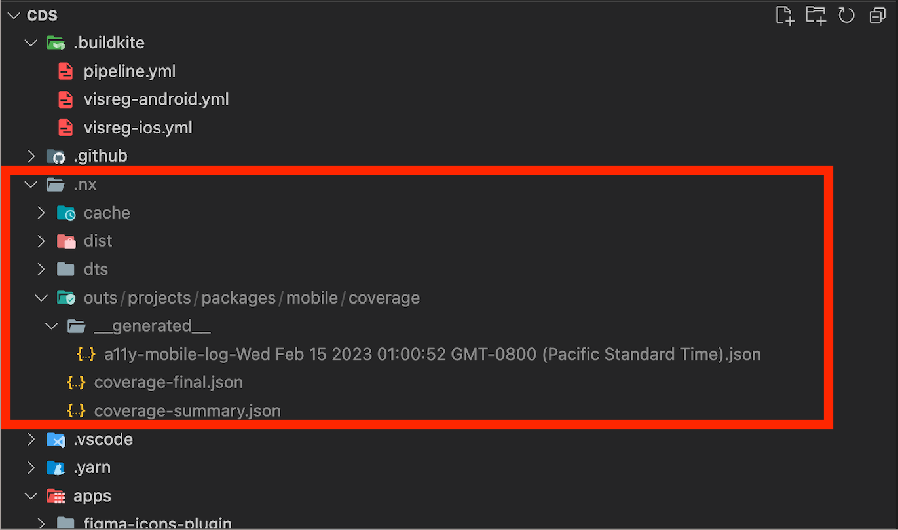
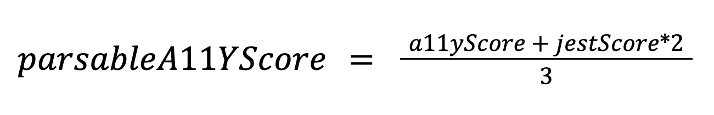
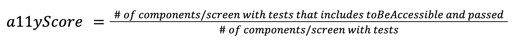
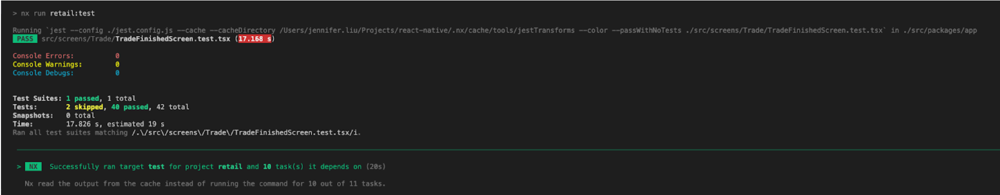

<h1 align="center">A11 Executor</h1>

## Table of Contents

- [Overview](#overview)
- [How to use](#how-to-use)
  - [Installation](#installation)
  - [General Usage](#general-usage)
    - [Prerequisite Knowledge](#prerequisite-knowledge)
    - [Add and run executor locally](#add-and-run-executor-locally)
    - [Add and run executor on CI](#add-and-run-executor-on-ci)
- [Understanding the report](#understanding-the-report)
  - [Why create a score?](#why-create-a-score)
  - [What is parsableA11yScore?](#what-is-parsablea11yscore)
    - [What is a11yScore?](#what-is-a11yscore)
    - [What is jestScore](#what-is-jestscore)
  - [parsableA11yScore for Retail Mobile on Dec 7th, 2022](#parsablea11yscore-for-retail-mobile-on-dec-7th-2022)
  - [Other helpful metrics](#other-helpful-metrics)
- [2023 Roadmap](#2023-roadmap)
- [Contribution](#contributing)
  - [Setup](#setup)
  - [Testing the executor](#testing-the-executor)
  - [Understanding the architecture](#understanding-the-architecture)
- [Related Links](#related-links)

# Overview

A11y Executor is an automated tool for measuring the accessibility-ness of a mobile application. It is not a tool to detect accessibility issues. To detect accessibility issues, please use the open-source package [react-native-accessibility-engine](https://www.npmjs.com/package/react-native-accessibility-engine). A11y Executor can be run on any repository that has nx setup and is a React-Native application. It is meant to be used in tandem with the [react-native-accessibility-engine](https://www.npmjs.com/package/react-native-accessibility-engine).

It is important to note: A11y Executor is only one of the many executors inside `@cbhq/ui-scorecard` package. Once you have installed the package and added the executor to the project you want metrics for, you can now run the executor (more information on how to install and use the executor in this [section](#add-and-run-executor-locally)). Once the executor successfully finishes its task, the report will be generated in the .nx folder. The output location is dependent on where your project is.

Here is an example of where the output goes when the executor is run on the CDS mobile package.


Not everyone likes reading, so we also created a [video](https://drive.google.com/file/d/1nAwEi4hYJZCSowbUQWIyc1BcOttIMcYn/view?usp=sharing)

# How to use

## Installation

```
yarn add --dev @cbhq/ui-scorecard
```

You read it right. This should only be a dev dependency as these tools are not necessary to run the actual mobile application.

## General Usage

### Prerequisite knowledge

To understand how a11y executor works, you must first understand what [nx task executor](https://nx.dev/plugin-features/use-task-executors) is. With that understanding, everything becomes easy.

### Add and run executor locally

If you just want to be able to run the executor locally, not on CI, you can do this.

Add the task executor to the target within a project that you are interested in tracking accessibility for.

Here is a snippet for adding the task to the target

```
{
   // …
   “targets”: {
        // …
        "audit-a11y": {
            "executor": "@cbhq/ui-scorecard:audit-a11y",
            // This depends on test because we have to capture
            // the jest coverage score line to generate the parsableA11yScore
           “dependsOn”: [“^build”, “test”]
        },
    }
}
```

For example, if you are interested in tracking for accessibility in the retail mobile app, you would add the task to the project.json [here](https://github.cbhq.net/consumer/react-native/pull/17091/files#diff-dfe9f3b550a63164e5df3b30ac99517e971486c15fd9c50e1555a7d1cbe695c3R111).

**Note:** You can name the key in project.json hashmap as anything. But we recommend keeping it as "audit-a11y". As this name matches the functionality of the executor.

When you run this locally, you will get the output here in the `.nx/outs` directory. For retail, this was where the output log was generated.
<br />


**Here are some example PRs:**

- [Adding it to Retail Mobile App](https://github.cbhq.net/consumer/react-native/pull/17091)
- [A11y Log from Dec 7th 7:46 PST](https://drive.google.com/drive/folders/1rjkC0fxuA4VTdPz9gFI5ju0y47xarXpm)

Suppose you want to run the audit-a11y executor in the [mobile package](https://github.cbhq.net/frontend/cds/blob/3dae0cb8cfa35ae21c958c097137cb2e0dc5825b/packages/mobile/project.json). Here is the command for it

```
yarn nx run mobile:a11y-audit
```

### Add and run executor on CI

You may want to add this step to your CI so that every time you are merging to master, it will generate the report and send it to Snowflake. (The sending to Snowflake part is not done yet. It is part of 2023 Roadmap)

Add this to your .pipeline.yml. Here is an [example](https://github.cbhq.net/consumer/react-native/pull/17091/files#diff-a3991ebf1475eb82acab13946ffc1eca02b43917f6d5bec3898f45c8b0b9bd53R154)

```
steps:
  // ……
  - label: Report A11y on Mobile
    <<: *nx_shared_step
    commands:
      - scripts/ci/setup.sh
      - yarn nx run-many --target=a11y --all
    artifact_paths: '**/artifacts/a11y-mobile.*'
```

# Understanding the Report

## Why create a score?

The overall score is important to give you a gauge on how accessible your mobile app is, but like all scores, take it with a grain of salt. It is only one metric to indicate accessibility, but it is not the full picture. These are the [rules](https://github.com/aryella-lacerda/react-native-accessibility-engine#current-rules) that the `toBeAccessible` test matcher checks for. These are not all the rules that exist. We will incrementally add more rules with time. Further, there are rules that cannot be captured through automation. Thus, I stress that this is not the full picture and why we call it the parsableA11yScore.

With that, let's talk about how the parsableA11yScore is generated. We created this score to help incentivize fixing accessibility issues. I want you to understand what contributes to this score, so you know exactly how to improve it.

## What is parsableA11yScore?

This is the final accessibility score for the app which this executor is run on.



### What is a11yScore?



Lets break these number down and understand what the numerator and denominator mean.

**What does # of components/screen with tests mean?**
The number of components/screen with tests mean that the component/screen has a matching test file. Say we have a component AssetRatingTitle. If we find a file AssetRatingTitle.test.tsx, then we say AssetRatingTitle has a test. Thus, if you create a test file that is testing AssetRatingTitle but is not named AssetRatingTitle.test.tsx, it will not be captured.

**What does the # of components/screen with tests that includes toBeAccessible and passed mean?**

This number captures the number of components/screen with tests that have toBeAccessible and is passing.

Let's take this component, [AssetRatingTitle](https://github.cbhq.net/consumer/react-native/blob/af3d47c739f429e1eca3b5d19243d91a545a8d36/src/packages/app/src/screens/AssetStructuredReview/components/AssetRatingTitle.tsx) from Retail as an example. This is a component that has a test because the file AssetRatingTitle.test.tsx exists.

This test has a toBeAccessible, but the toBeAccessible is not passing. While it “passes” the test for CI purposes, it throws a console.error which violates A11Y. Hence it is not passing. Therefore, AssetRatingTitle would not increment this score because it has a failing toBeAccessible test.


Here is an example of a test case that passes a11y. It will not show any console.error



### What is jestScore?


The jestScore has a weight of 2 because we find that it is more important than the a11yScore. If your overall Jest test coverage is poor, a high a11yScore on a small subset of your code base is not that significant.

To give you a concrete example of the problem. Suppose you have 500 components. Of the 500 components, you have 250 test files. That means only 250 files can have toBeAccessible. So while 250/250 of those files have toBeAccessible, giving your a11yScore 100%, you are not truly 100% accessible because half of your components aren't even covered. Therefore, jestScore is extremely important in this equation.

### parsableA11yScore for Retail Mobile on Dec 7th, 2022

We ran this executor on the Retail Mobile App repository on Dec 7th 2022. Here is the [code](https://github.cbhq.net/consumer/react-native/pull/17091/files#diff-dfe9f3b550a63164e5df3b30ac99517e971486c15fd9c50e1555a7d1cbe695c3R111) that adds the executor to run this on the Retail App.

Here is the [log](https://drive.google.com/drive/folders/1rjkC0fxuA4VTdPz9gFI5ju0y47xarXpm) that was generated on Dec 7th 2022 19:56:02 (7:56 pm PST). Here are the key metrics:

| keyName on Log                          | Description of keyName                                                                   | value |
| --------------------------------------- | ---------------------------------------------------------------------------------------- | ----- |
| totalNumberOfToBeAccessibleTests        | Total number of tests that have toBeAccessible                                           | 753   |
| totalNumberOfPassingToBeAccessibleTests | Total number of tests that have toBeAccessible and is passing                            | 441   |
| totalNumberOfComponentsWithTest         | Total number of screens/components that have a matching test file                        | 810   |
| totalNumberOfComponents                 | Total number of screens/components. We called it components to keep the key name shorter | 2447  |

Therefore, the parsableA11yScore = 0.622. Here is a breakdown of the numbers

| Metric                         | Metric Result                 |
| ------------------------------ | ----------------------------- |
| a11yScore on Retail Mobile App | 441 / 810 = 0.544             |
| jestScore                      | 0.6614                        |
| parsableA11yScore              | (0.544 + 0.6614\*2)/3 = 0.622 |

## Other helpful metrics

We care deeply about our customers, and try to add as many features to help make their lives easier when it comes to remediating accessibility issues.

Our log shows a list of test files that do not have toBeAccessible tests. By adding toBeAccessible tests to these test cases, you will greatly increase your score.

Here is the output from Retail Mobile App


We also capture a list of tests that are failing toBeAccessible and the reasons for the failures. Currently, messages are output in ANSI format, which means for the time being you'll need to manually console.log the messages to view the output in a more readable format. Alternatively, you can also run the test locally to view any errors.

By fixing failing tests, the a11yScore can be greatly improved. In this example, remediating all of the failures would result in raising totalNumberOfPassingToBeAccessibleTests from 441 to 753, resulting in an a11yScore of ~93% (753/810). If we were to also add toBeAccessible to the remaining tests, we could raise our a11yScore to a perfect 100%.

PASSED toBeAccessible - Here is an example of a test that passed the toBeAccessible test.


FAILED toBeAccessible - Here is an example of a test that failed the toBeAccessible test. As mentioned previously, the message is captured in an ansi form


# 2023 Roadmap

We have drafted the features we think will be highest priority for this product for 2023. The features are ranked based on priority. Thus, if it is the 1st on the list, it means it is the highest priority.

Each item also includes a note in brackets which attempts to estimate the difficulty/complexity of the task. You can also view a history of the roadmap for this project in this [doc](https://docs.google.com/document/d/1msNpZVw-sh_ouGtQHIcy-rmneP3ePBTI6W6KwDKGs7s/).

## New Features for A11y Engine Executor

1. Transforming the raw data into a way that snowflake understands [don’t know]
   a. [Product scorecard roadmap](https://docs.google.com/document/d/1z3olkpjXzxM5EKjvP1sKKdekQAp_qLFI08Xeviwr9kA/edit)
2. Add the parsableA11yScore on the scorecard [easy]
3. Add linter rule - if the jest test is for a screen or component, it should warn them and say they should add a a11y jest test [medium]
4. Add audit-a11y executor to nx-scaffolder for React Native projects (example: https://frontend.cbhq.net/nx/new-package) [don't know]
5. Think of ways to optimize the time it takes to run jest tests that have toBeAccessible [difficult]

## New Features for react-native-accessibility-engine (RNAE)

1. Create a framework to determine what rule sets are highest priority to fix [don't know]
2. Add new rules to the library (it's open source) [medium]
3. Rank rules based on criticality [medium]

## Monitoring

1. Datadog dashboard to monitor the number of projects that are using this audit-a11y executor [don't know]
2. Monitor the number of projects who has @cbhq/eslint-plugin a11y rule enabled [don't know]
3. Monitor the average time the executor takes to run. Create Datadog dashboard [don't know]
4. Monitor the resource usage (RAM, CPU, Network IO etc..) [don't know]

# Contributing

Contributions are always welcome, no matter how large or small!

## Setup

On the first checkout of the repository, you'll need to install dependencies and build the project.

To install dependencies, run

```
yarn install
```

To build the ui-scorecard package, run

```
yarn nx run ui-scorecard:build
```

## Testing the executor

We have integrated this executor into the @cbhq/cds-mobile package. [Here](https://sourcegraph.cbhq.net/github.cbhq.net/frontend/cds/-/blob/packages/mobile/project.json?L20) is where the executor is integrated. We recommend using this package as a testing ground for new features.

The command to run the a11y report for the cds-mobile package:

```
yarn nx run mobile:audit-a11y
```

## Understanding the architecture

The `impl.ts` file is the entry point. Think of it like an `index.ts` file for an app. This is the file that gets executed when you run `nx run <project-name>:audit-a11y`. The `implementation` field in [executor.json](https://github.cbhq.net/frontend/cds/blob/965687c6a58fd770c6c7eefbed51dd454d9cea72/packages/ui-scorecard/executors.json) is what determines the entry point of this executor.

## Related Links

- [Mobile A11y Runbook](https://docs.google.com/document/d/1fCmteNp_ZEWoMxi74YZnbvhGV3CnZjUlWzAeF-9_1Sk/edit#heading=h.2y07lmtwzk7o) - This contains instructions to run the [react-native-accessibility-engine](https://github.com/aryella-lacerda/react-native-accessibility-engine) as well.
- [A11y Measurement Epic](https://jira.coinbase-corp.com/browse/CDS-2572)
- [A11y Measurement Epic - Filtered tickets based on Code Optimization tag](https://jira.coinbase-corp.com/browse/CDS-2809?jql=project%20%3D%20%22Coinbase%20Design%20System%22%20AND%20labels%20%3D%20code-optimization%20AND%20%22Epic%20Link%22%20%3D%20CDS-2572%20)
- [A11y Engine Initial Project TDD](https://docs.google.com/document/d/1y9T3tP-40gPqMxcQAE-Ast4M08n-sK7z2tO5BaTAHMc/edit)
- [Sample JSON Outputs](https://drive.google.com/drive/u/0/folders/1VimSMEclCl45PbDl2jkw5Lk4QHOSMaAa)
- [Support Channels](#support-channels)
  - Slack Handle: [#ask-ui-systems-accessibility-tooling](https://coinbase.slack.com/archives/C03TGNBJCMQ)
  - Handy Go links:
    - [go/mobile-a11y-runbook](https://docs.google.com/document/d/1fCmteNp_ZEWoMxi74YZnbvhGV3CnZjUlWzAeF-9_1Sk/edit#heading=h.2y07lmtwzk7o)
