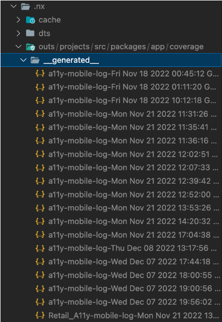
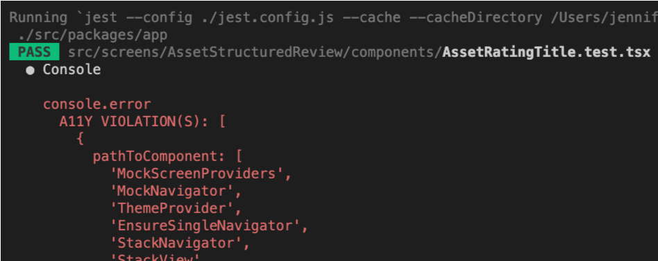
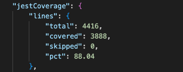
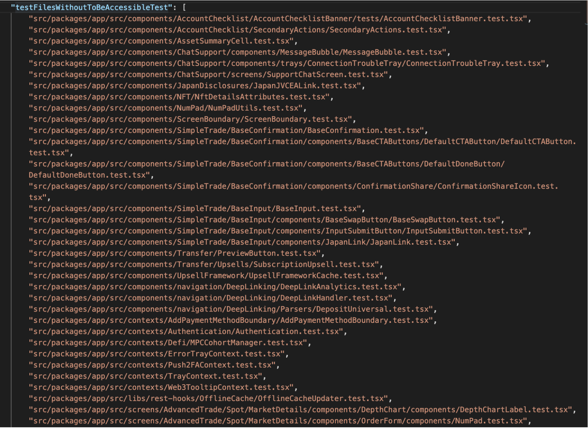
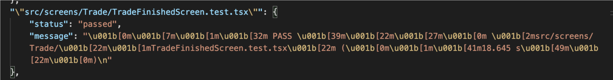
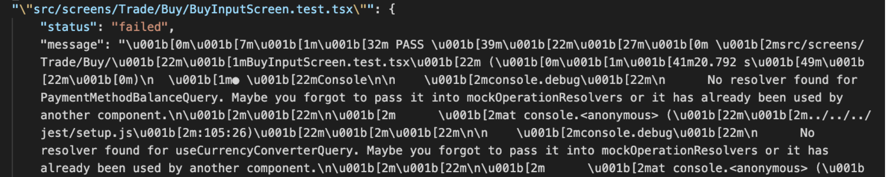

# A11y Executor

## Table of Contents

- [Overview](#overview)
- [Getting Started](#getting-started)
  - [Installation](#installation)
  - [Configuration](#configuration)
    - [Sending Scores to Snowflake](#sending-scores-to-snowflake)
  - [Executing Locally](#executing-locally)
  - [Executing on CI](#executing-on-ci)
- [Understanding the Report](#understanding-the-report)
  - [Why automatedA11yScore?](#why-automateda11yscore)
  - [What is automatedA11yScore?](#what-is-automateda11yscore)
    - [What is a11yScore?](#what-is-a11yscore)
    - [What is jestScore?](#what-is-jestscore)
  - [Example Scores](#example-scores)
  - [Other Metrics and Info](#other-metrics-and-info)
- [Roadmap](#roadmap)
- [Contributions](#contributions)
  - [Setup](#setup)
  - [Feature Testing](#feature-testing)
  - [Architecture](#architecture)
  - [A11y Scorecards](#a11y-scorecards)
- [Related Links](#related-links)

## Overview

A11y Executor is an automated solution for assessing the accessibility of Coinbase React Native / React apps and is intended to be used in conjunction with [React Native Accessibility Engine](https://www.npmjs.com/package/react-native-accessibility-engine) (RNAE) and [jest-axe](https://github.com/nickcolley/jest-axe#readme).

- **RNAE** is an open-source library that facilitates developers in evaluating and enhancing the accessibility of their React Native apps by employing predefined rules and custom Jest matchers.

  - For testing on mobile repos, we use the `toBeAccessible` tests.

- **jest-axe** is a custom Jest matcher for axe for testing accessibility
  - For testing on web repos, we use the `toHaveNoViolations` tests.

A11y Executor is one of several executors included in the `@cbhq/ui-scorecard` package. After installing the package and integrating the executor into your project, you can use it to generate an accessibility report for your app.

This short [video](https://drive.google.com/file/d/1nAwEi4hYJZCSowbUQWIyc1BcOttIMcYn/view?usp=sharing) provides a high level overview of its features.

### Enhanced Features

We have extended the A11y Executor with some additional features:

- File path targetting and CODEOWNERS mapping.
- Support for both web and mobile repositories.

#### File path targetting and CODEOWNERS mapping.

This allows running accessibility tests on specific files or directories and mapping the results to the responsible code owners. We map CODEOWNERS to their respective filepaths and get an a11y score for each. We generate each report in parallel and batch send to Snowflake. See [Executing Locally](#executing-locally) on how to run for specific / multiple filepaths.

Sample CODEOWNERS file:

```
# CODE OWNERS TEST FILE
# USING CDS REPO

# FROM TEST 1
packages/mobile/buttons/ @test/buttontest

# FROM TEST 2
packages/mobile/banner/ @test/bannertest
```

## Getting Started

Having some context around [Nx task executors](https://nx.dev/plugin-features/use-task-executors) will make the following setup easier to understand.

### Installation

Documentation for [library installation and setup](https://docs.google.com/document/d/1fCmteNp_ZEWoMxi74YZnbvhGV3CnZjUlWzAeF-9_1Sk/edit?usp=sharing)

```sh
yarn add --dev @cbhq/ui-scorecard
```

Install this package as a dev dependency as it's not required to run your app.

### Configuration

Add the task to the list of targets in your `project.json` file:

```json
{
  // …
  “targets”: {
    // …
    "audit-a11y": {
      "executor": "@cbhq/ui-scorecard:audit-a11y",
      "dependsOn": [
        "^build",
        "test"
      ]
    },
  }
}
```

Our task is dependent on your `test` task because we require test coverage info in order to generate the [automatedA11yScore](#what-is-automateda11yscore).

Options for configuing the executor are listed in the `properties` of [schema.json](./src/executors/audit-a11y/schema.json):

```json
{
  // …
  “targets”: {
    // …
    "audit-a11y": {
      "executor": "@cbhq/ui-scorecard:audit-a11y",
      "options": {
        "cache": false,
        "debug": true,
      },
      "dependsOn": [
        "^build",
        "test"
      ]
    },
  }
}
```

To configure specific file paths to run a11y engine on, we can add the targetPath and codeOwnerFilePath:
Note: You must specify the platform (web / mobile).

```json
{
  // …
  “targets”: {
    // …
    "audit-a11y": {
      "executor": "@cbhq/ui-scorecard:audit-a11y",
      "options": {
        "eventProjectName": "consumer_onboarding",
        "targetPath": "/src/packages/onboarding/",
        "codeOwnerFilePath": ".github/CODEOWNERS",
        "platform": "mobile",
      },
      "dependsOn": [
        "^build",
        "test"
      ]
    },
  }
}
```

#### Sending Scores to Snowflake

Configuring your task with the `eventProjectName` option will automatically send your `automatedA11yScore` to [Snowflake](https://confluence.coinbase-corp.com/display/DATA/Snowflake+Documentation), our company-wide data warehouse. If an `eventProjectName` is not provided, no data will be sent.

Event properties:

| Key                | Value                                 |
| ------------------ | ------------------------------------- |
| project_name       | `eventProjectName` from config option |
| event_type         | "accessibility_score"                 |
| action             | "measurement"                         |
| automatedA11yScore | `automatedA11yScore`                  |

An updated `automatedA11yScore` will be sent each time the `audit-a11y` task is executed.

By default, events are written to `events.analytics_service`, Snowflake's production table. However, you can instead send events to the `events_dev.analytics_service` development table (e.g. for testing purposes) by setting the `sendEventsToProd` option in your task config to `false`, or by passing a `--no-sendEventsToProd` flag when executing the script via CLI (see [Executing Locally](#executing-locally) below).

If there is a [product scorecard](https://scorecards.cbhq.net/) currently configured for your app/project, your `automatedA11yScore` data will be automatically pulled from Snowflake's production table and made available for viewing on the scorecard. Be sure to provide the same `eventProjectName` that your scorecard is using for your project in Snowflake, otherwise your `automatedA11yScore` data will not be captured.

### Executing Locally

```sh
yarn nx run mobile:audit-a11y
```

You can also pass any of the `properties` defined in [schema.json](./src/executors/audit-a11y/schema.json) as additional CLI flags, and these will override any `options` or `properties` defaults defined in your `project.json` or `schema.json` files, respectively:

```sh
yarn nx run mobile:audit-a11y --no-sendEventsToProd --debugEvents
```

To execute specific a11y scores for specific or multiple paths, we can use the `targetPath` and `codeOwnerFilePath` as shown below:

```sh
yarn nx run <targetProject>:audit-a11y --targetPath=<path-string-to-filter-by> --codeOwnerFilePath=<path-to-codeowner-file>
```

Example for CDS Mobile:

```sh
yarn nx run mobile:audit-a11y --targetPath=/packages/mobile/screens  --codeOwnerFilePath=.github/CODEOWNERSTEST

```

When run locally, the report is output to the `.nx/outs` directory. This is the report location when the script is executed in the [Consumer - React Native repository](https://github.cbhq.net/consumer/react-native):



### Executing on CI

**_NOTE: This section is still WIP_**

If you want to enable automation on CI and perform a regular a11y audit of your code base, add a step to your `.pipeline.yml` file:

```yml
steps:
  # …
  - label: Report A11y on Mobile
    <<: # shared step(s) if required
    commands:
      -  # setup script(s) if required
      - yarn nx run-many --target=audit-a11y --all
    artifact_paths: '**/artifacts/a11y-mobile-log.*' # report output location
```

## Understanding the Report

### Why automatedA11yScore?

The primary objective behind establishing this score is to promote the resolution of accessibility issues.

This score acts as a gauge for the accessibility of a mobile app, but it only covers a specific set of metrics and doesn't offer a complete assessment.

- For mobile: We utilize a `toBeAccessible` test to evaluate the mobile app according to these [RNAE rules](https://github.com/aryella-lacerda/react-native-accessibility-engine#current-rules), which are not comprehensive.

- For web: We utilize a `toHaveNoViolations` test to evaluate the web app according to these [a11y rules](https://github.com/dequelabs/axe-core/blob/develop/doc/rule-descriptions.md).

Over time, we plan to incrementally expand the rule set. However, it's important to note that some accessibility guidelines cannot be assessed through automation alone. As a result, this score is limited in scope, which is why we refer to it as the `automatedA11yScore`.

### What is automatedA11yScore?

The `automatedA11yScore` is a metric representing the accessibility of a the mobile/web app, based solely on the results of automated accessibility testing. It provides a limited assessment of overall compliance.

$$
automatedA11yScore = \frac{a11yScore}{100} \times jestScore
$$

- Note: The jestScore used in the calculation of `automatedA11yScore` is the `filteredJestScore` which is the total jest code coverage percentage of files specified in the codeowners file. By default it is the entire repo unless codeowners are specified.

#### What is a11yScore?

$$
a11yScore = \frac{\text{components and screens with passing }Accessibility\text{ tests}}{\text{components and screens with tests}}\times 100
$$

##### Components and Screens with Tests

These are the components and screens that have a corresponding test file with a matching name. For instance, if a component is named `ComponentName`, a test file named `ComponentName.test.tsx` is expected. If the test file for `ComponentName` has a different name, it will not be captured.

##### Components and Screens with Passing Accessibility Tests

These are the components and screens that have a corresponding test file (see [Components and screens with tests](#components-and-screens-with-tests) above) with passing `toBeAccessible`(mobile) or `toHaveNoViolations` (web) tests. A `toBeAccessible` or `toHaveNoViolations` test will fail when an a11y violation is detected:



#### What is jestScore?

$$
jestScore = \text{Jest code coverage percentage (by line)}
$$



The `jestScore` carries a weight of 1 in the `automatedA11yScore` calculation as it is considered important to take into consideration with the `a11yScore`. A high `a11yScore` is less meaningful if your overall Jest test coverage is poor.

To illustrate this, imagine you have 500 components. Of these, only half (250) have matching test files. If all 250 test files contain a passing `toBeAccessible` test, your resulting `a11yScore` would be 100%. However, your app is not truly 100% accessibile since only half of your components were tested and audited.

### Example Scores

We performed a test of this executor on the [Consumer - React Native repository](https://github.cbhq.net/consumer/react-native) on Dec 7th, 2022.

Here are the key metrics from the [report](https://drive.google.com/drive/folders/1rjkC0fxuA4VTdPz9gFI5ju0y47xarXpm) that was generated from this test run:

| Metric                              | Description                                                                                       | Value |
| ----------------------------------- | ------------------------------------------------------------------------------------------------- | ----- |
| logTotalNumberOfAccessibleTests     | Total number of test files with accessibility (toBeAccessible / toHaveNoViolations) tests         | 753   |
| totalNumberOfPassingAccessibleTests | Total number of test files with passing accessibility (toBeAccessible / toHaveNoViolations) tests | 441   |
| totalNumberOfComponentsWithTest     | Total number of components and screens that have a matching test file                             | 810   |
| totalNumberOfComponents             | Total number of components and screens                                                            | 2447  |

| Score              | Calculation           | Result |
| ------------------ | --------------------- | ------ |
| a11yScore          | (441 / 810) \* 100    | 54.44  |
| jestScore          | 66.14                 | 66.14  |
| automatedA11yScore | (54.44/100 \* 66.14 ) | 36.01  |

### Other Metrics and Info

The report includes a `testFilesWithoutToBeAccessibleTest` and `testFilesWithoutToHaveNoViolations` field, which highlights test files lacking `toBeAccessible` or `toHaveNoViolations` tests:



Adding missing `toBeAccessible` or `toHaveNoViolations` tests will increase your `a11yScore`, leading to an improved `automatedA11yScore`.

Under the `testDetails` field, a list of test files containing accesibility tests is also captured, along with their pass or fail status and the corresponding test message details. At present, messages are output in ANSI format. To view the output in a more readable format, you'll need to process the messages with another tool capable of parsing ANSI (e.g. `console.log`). Alternatively, you can run the test locally to view any errors.

PASSING `toBeAccessible`:



FAILING `toBeAccessible`:



Fixing failing tests will naturally improve your `a11yScore`. Using our previous [example](#example-scores), remediating all of the failures would increase `totalNumberOfAccessibleTests` from 441 to 753, resulting in an `a11yScore` of ~93% (753/810). If we were to also add missing `toBeAccessible` tests to the remaining test files, we would raise our `a11yScore` to a perfect 100%.

#### Terminology

- `totalNumberOfComponents`: Total number of components and screens

- `totalNumberOfComponentTests`: Number tests that are testing a Component. Discovered that components with render is likely to be a component

- `totalNumberOfAccessibleTests`: Number of test files with toBeAccessible tests

- `totalNumberOfPassingAccessibleTests`: Number of test files with passing Accessible tests (`toBeAccessible` (mobile) or `toHaveNoViolations` (web))

- `totalNumberOfComponentsWithTest`: Total number of components and screens that have a matching test file

## Roadmap

View the current roadmap for this project [here](https://docs.google.com/document/d/1msNpZVw-sh_ouGtQHIcy-rmneP3ePBTI6W6KwDKGs7s).

## Contributions

Contributions are always welcome, no matter how large or small!

### Setup

On the first checkout of the repository, you'll need to install dependencies and build the project.

To install dependencies, run

```sh
yarn install
```

To build the `@cbhq/ui-scorecard` package, run

```sh
yarn nx run ui-scorecard:build
```

### Feature Testing

A11y Executor is integrated into the `@cbhq/cds-mobile` and the `cbhq/cds-web` packages. You can manually test any features or modifications related to the executor with this package.

To run the a11y audit and generate an accessibility report for this package:

```sh
# mobile
yarn nx run mobile:audit-a11y

# web
yarn nx run web:audit-a11y
```

### Architecture

The [impl.ts](./src/executors/audit-a11y/impl.ts) file serves as the entry point for this project and is executed when running `nx run <project-name>:audit-a11y`. The entry point is determined by the `implementation` field in the [executor.json](./executors.json) file.

### A11y Scorecards

Yuo can see the aggregated results on our [A11y Scorecards](https://cds.cbhq.net/a11y-scorecards/) page.

Upon every run with the ui-scorecard a11y engine, we send our data to Snowflake. This allows us to track scores over time. From Snowflake, we create a derived table which is then moved into a TRS data system with an exposed data endpoint. Our [go/cds a11y page](https://cds.cbhq.net/a11y-scorecards/) uses this endpoint to fetch the TRS data.

If you need information on how to modify the endpoint, or modify values in the Snowflake schema see the development guide:

- [Development Guide (Pynest - Snowflake Schema, Scorecard Go Endpoint)](https://docs.google.com/document/d/1pYk3BjmZeSjIqSLuzY5VRCCnzY0moo2RhIKq_tw3jpA/edit?usp=sharing)
- [A11yScorecardsOverview (Main source file for a11y web page)](https://github.cbhq.net/frontend/cds/blob/master/apps/website/components/A11yScorecards/A11yScorecardsOverview.tsx)

## Related Links

- [Mobile A11y Runbook](https://docs.google.com/document/d/1fCmteNp_ZEWoMxi74YZnbvhGV3CnZjUlWzAeF-9_1Sk/edit#heading=h.2y07lmtwzk7o) - This contains instructions to run the [react-native-accessibility-engine](https://github.com/aryella-lacerda/react-native-accessibility-engine) as well.
- [Roadmap](https://docs.google.com/document/d/1msNpZVw-sh_ouGtQHIcy-rmneP3ePBTI6W6KwDKGs7s)
- [A11y Measurement Epic](https://jira.coinbase-corp.com/browse/CDS-2572)
- [A11y Measurement Epic - Filtered tickets based on Code Optimization tag](https://jira.coinbase-corp.com/browse/CDS-2809?jql=project%20%3D%20%22Coinbase%20Design%20System%22%20AND%20labels%20%3D%20code-optimization%20AND%20%22Epic%20Link%22%20%3D%20CDS-2572%20)
- [A11y Engine Initial Project TDD](https://docs.google.com/document/d/1y9T3tP-40gPqMxcQAE-Ast4M08n-sK7z2tO5BaTAHMc/edit)
- [Sample JSON Outputs](https://drive.google.com/drive/u/0/folders/1VimSMEclCl45PbDl2jkw5Lk4QHOSMaAa)
- Slack: [#ask-ui-systems-accessibility-tooling](https://coinbase.slack.com/archives/C03TGNBJCMQ)
- Go links:
  - [go/mobile-a11y-runbook](https://docs.google.com/document/d/1fCmteNp_ZEWoMxi74YZnbvhGV3CnZjUlWzAeF-9_1Sk/edit#heading=h.2y07lmtwzk7o)

## Troubleshooting

1. `The "path" argument must be of type string. Received undefined`.

- Make sure `@cbhq/ui-scorecard` is in your project dependencies. If not, run `yarn add --dev @cbhq/ui-scorecard`.

2. `Coverage Summary does not exist at ...`

- Jest coverage may not be enabled by default. Make sure your jest config has `coverageReporters: ['json-summary']` which generates coverage summary after tests run. The report will be picked up by the executor.

3. External testing: Ensure to build the package before running the script in external repository.

- `yarn nx run ui-scorecard:build`

### FAQ

Is there's a way to specifically check which files need the unit tests?

- You can run the a11y engine locally on the frontend repo after changing the codeowner file to only `retail-financing-defi-frontend` (for example).
- This will output a json report of all file paths owned by `retail-financing-defi-frontend` which are lacking tests.
- Alternatively - a faster way would be, you can use the VSCode search all option and search only in file directories which are owned by `retail-financing-defi-frontend`.

- Example: From the codeowners (web / coinbase-www) file, looks like it would be:

  - src/views/YieldCenter
  - src/components/YieldPromotions
  - src/components/StakingV2
  - src/components/WrappedAsset

- Note to add unit tests to any components in it which is missing a toBeAccessible test (mobile) or toHaveNoViolations test (web).
