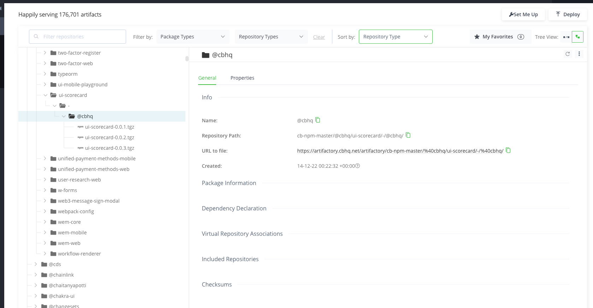

# @cbhq/ui-scorecard

## Table of Contents

- [Overview](#overview)
- [List of executors in this package](#list-of-executors)
- [How to deploy package to artifactory](#how-to-deploy-the-package-to-artifactory)

### Overview

Adoption

When a PR is merged to master, we should run tracker on affected files

### List of executors

- [A11y Executor README](./A11y_Executor_README.md)

# How to deploy the package to Artifactory

We will walk you through deploying a newer version of the package to artifactory. There are two ways to complete step 1. Doing it the mono-pipeline way is the recommended approach, but it is not working yet (we will investigate). Please do it manually for the time being until we fix the mono-pipeline issue.

### Step 1: Bump @cbhq/ui-scorecard package manually

1. Bump the version in package.json. Adhere to the [semver semantics](https://semver.org/)
2. Add the necessary message to CHANGELOG.md. Be descriptive, and add it to the right section.
3. Create a PR, and merge the PR

### Step 1 (This doesn't work yet. The version it bumps to is not correct. DO NOT USE): Bump @cbhq/ui-scorecard using mono-pipeline

> Please do not use this approach yet. TODO: Investigate why the mono-pipeline is always bumping to a patch version even though regardless of whether its a breaking, or update change.

1. To bump this package using mono-pipeline, run the command below at the root of the repo

```
yarn bump-version ui-scorecard
```

Just follow the instructions and it should work. If mono-pipeline fails to work at any point, you can bump it manually. See steps below.

### Step 2: Deploy the package to Artifactory

1. Go to the "[Deploy](https://codeflow.cbhq.net/#/frontend/cds/commits)" tab in Codeflow
2. Click on a commit to deploy (typically the latest one)
3. When build is green, click the "Deploy to corporate" button
4. Select `corporate::ui-scorecard` and click "OK"
5. Monitor the deploy in the right panel by viewing "Deploy logs"
6. Verify the deploy by visiting [ui-scorecard Artifactory](https://artifactory.cbhq.net/ui/repos/tree/General/cb-npm-master/@cbhq/ui-scorecard/-/@cbhq). If it was a success, you should see the tgz with your new version there.

As you can see in this screenshot, we have 3 versions of this package. If your deployment was successful, you should see `ui-scorecard-<latest-version>.tgz` in that dropdown.
<br />

